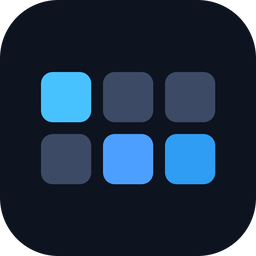
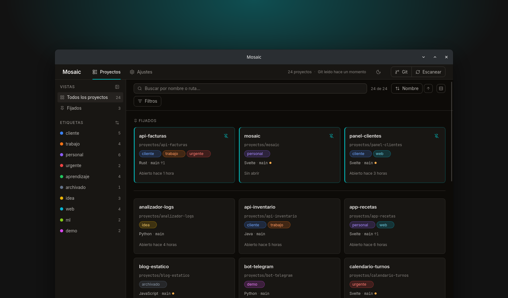
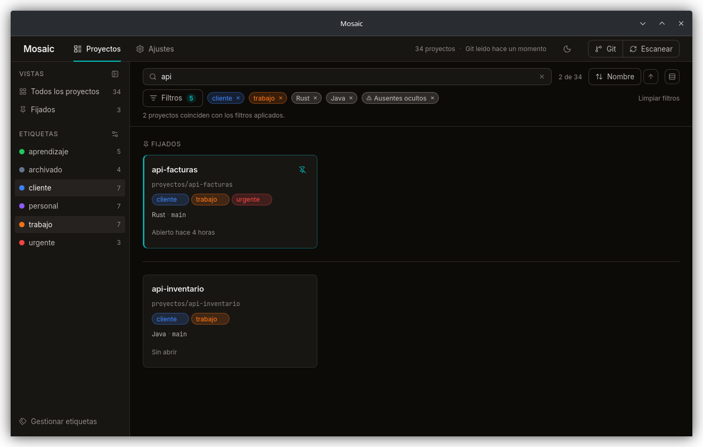
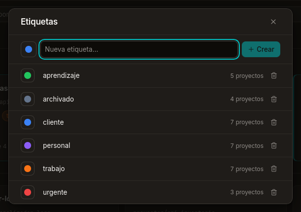
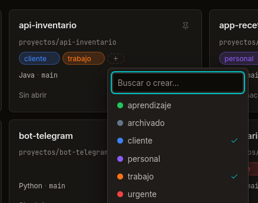
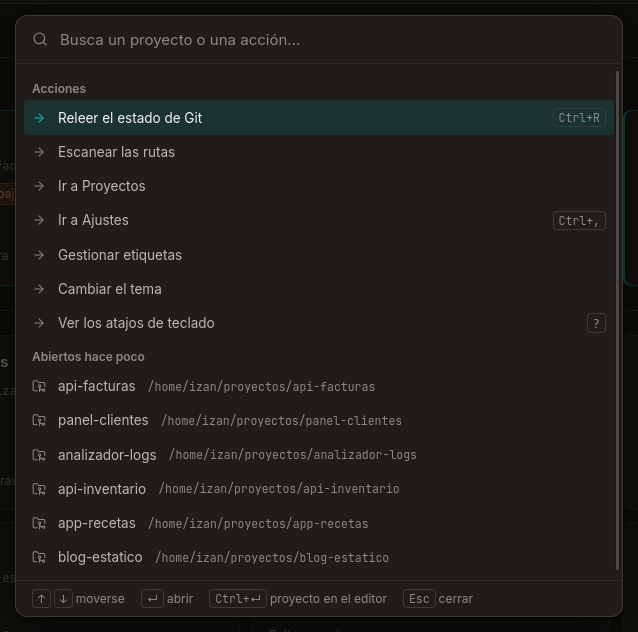
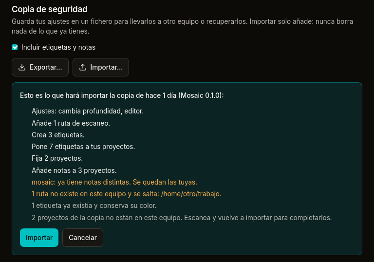
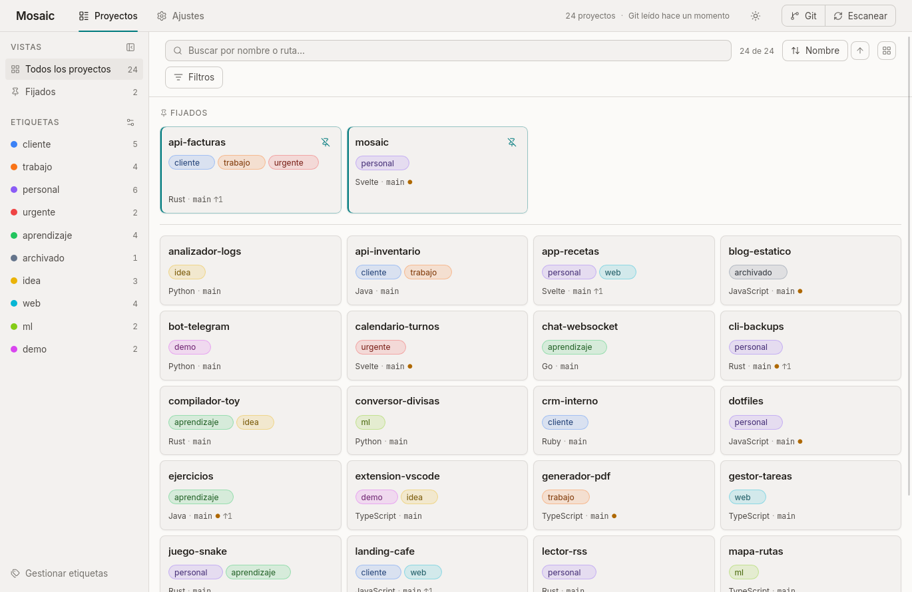
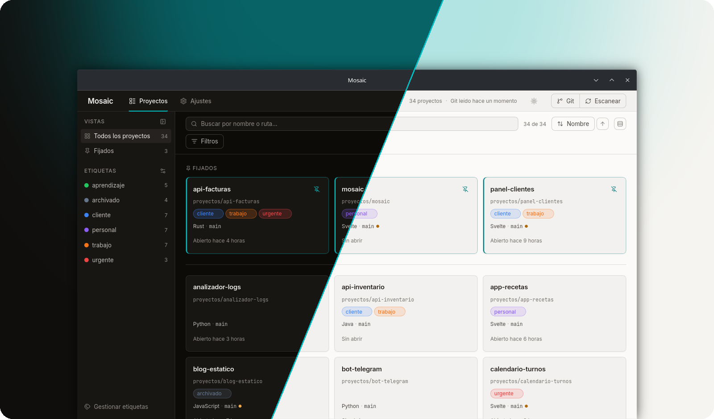

<div align="center">



<h1>Mosaic</h1>

<p><a href="README.md">Español</a> · <b>English</b></p>

<p><b>All your code projects, on one board.</b></p>

<p>Live Git status, tags and one click to open each project.<br>
Local, private, and not a single network request.</p>

<p>


</p>

<p>
<a href="https://github.com/IzanVil/mosaic/releases/latest"></a>
</p>

<p>
<a href="https://mosaic-app.i-vilches.workers.dev"><b>Website</b></a> ·
<a href="#-download"><b>Download</b></a> ·
<a href="#-what-it-does"><b>What it does</b></a> ·
<a href="#-screenshots"><b>Screenshots</b></a> ·
<a href="#-getting-started"><b>Getting started</b></a> ·
<a href="#-status"><b>Status</b></a> ·
<a href="#-build"><b>Build</b></a>
</p>

<br>

<picture>
  <source media="(prefers-color-scheme: dark)" srcset="docs/img/portada-oscura.png">
  <source media="(prefers-color-scheme: light)" srcset="docs/img/portada-clara.png">
  
</picture>

</div>

<br>

> **Heads-up:** Mosaic's interface is in Spanish for now, as you'll see in the
> screenshots. An English interface isn't available yet.

## 💡 Why

Forty folders in `~/projects`, half of them with uncommitted changes you've
forgotten about, and opening the one you want means `cd`, `ls` and guessing.
**Mosaic gives you the bird's-eye view.**

<table>
  <tr>
    <td width="25%" valign="top">
      <h3>🔒 Local</h3>
      Everything lives in a SQLite file on your machine. Zero network requests, not even <code>git fetch</code>.
    </td>
    <td width="25%" valign="top">
      <h3>🕶️ Private</h3>
      No accounts, no telemetry, no analytics.
    </td>
    <td width="25%" valign="top">
      <h3>📖 Read-only</h3>
      It reads your repositories and never writes to them.
    </td>
    <td width="25%" valign="top">
      <h3>🧘 No AI</h3>
      No model APIs. It reads metadata and shows it to you.
    </td>
  </tr>
</table>

## ✨ What it does

<table>
  <tr>
    <td width="33%" valign="top">
      <h3>🔍 Finds them for you</h3>
      Point it at a folder and it spots each project by its <code>.git</code>, <code>package.json</code>, <code>Cargo.toml</code>, <code>go.mod</code>… It works out the main language too.
    </td>
    <td width="33%" valign="top">
      <h3>🌿 Git at a glance</h3>
      Branch, uncommitted changes, commits ahead of and behind the upstream, and the last commit. It refreshes in the background.
    </td>
    <td width="33%" valign="top">
      <h3>⚡ One click to open</h3>
      Opens each project in your editor, terminal or file manager. Mosaic detects what you have installed.
    </td>
  </tr>
  <tr>
    <td valign="top">
      <h3>🏷️ Colored tags</h3>
      Assign them right from the card, and create one on the fly just by typing a new name.
    </td>
    <td valign="top">
      <h3>🎯 Search and filters</h3>
      Fuzzy search that ignores accents and capitals. Filter by tag, language, Git state or pinned.
    </td>
    <td valign="top">
      <h3>🌗 Light or dark</h3>
      Or whatever your system uses. Mosaic remembers the theme, filters and sort order between sessions.
    </td>
  </tr>
  <tr>
    <td valign="top">
      <h3>⌨️ Keyboard first</h3>
      <kbd>Ctrl</kbd>+<kbd>K</kbd> opens a palette to jump to any project or action. <kbd>Ctrl</kbd>+<kbd>R</kbd> re-reads Git and <kbd>?</kbd> shows the rest.
    </td>
    <td valign="top">
      <h3>🧱 Comfortable or compact</h3>
      In compact mode each card keeps only the essentials and more than twice as many fit on screen.
    </td>
    <td valign="top">
      <h3>💾 Backup</h3>
      Export your settings, tags and notes to a file. Importing shows you what will change first and never deletes anything.
    </td>
  </tr>
  <tr>
    <td colspan="3" valign="top">
      <h3>📂 And a page for each project</h3>
      Click a card's name to see its README, branches, latest commits and your notes, which save themselves as you type. Escape takes you back to the board.
    </td>
  </tr>
</table>

<sub>Shortcuts, backup, the scan settings and the new compact mode arrive in the next release; 0.1.0 has everything else.</sub>

## 📸 Screenshots

<p align="center">
  
  <br><sub><b>Search and filter.</b> Each filter is a chip with its own X, and the counter shows how many are on.</sub>
</p>

<br>

<table>
  <tr>
    <td width="58%" align="center">
      
      <br><sub><b>Manage your tags</b> in a single panel.</sub>
    </td>
    <td width="42%" align="center">
      
      <br><sub><b>Tag from the card</b>, without leaving the board.</sub>
    </td>
  </tr>
</table>

<br>

<table>
  <tr>
    <td width="45%" align="center">
      
      <br><sub><b>The palette</b>: actions and projects one <kbd>Ctrl</kbd>+<kbd>K</kbd> away.</sub>
    </td>
    <td width="55%" align="center">
      
      <br><sub><b>Importing a backup</b>: the summary first, then you decide.</sub>
    </td>
  </tr>
</table>

<br>

<p align="center">
  
  <br><sub><b>Compact mode</b>: four columns and more than twice the projects in view.</sub>
</p>

<br>

<p align="center">
  
  <br><sub><b>Two themes</b> with the same warm palette, and a button in the header to switch between them.</sub>
</p>

## 🚀 Getting started

```
1. Ajustes (Settings)  →  Añadir carpeta     the folder that holds your projects
2. Escanear (Scan)                           Mosaic walks the disk and fills the board
3. Tag, pin and filter                       it'll be just as you left it next time
```

Git status is read five seconds after launch and every five minutes after that.
The **Git** button in the header forces a fresh read.

**Shortcuts** (from the next release on): <kbd>Ctrl</kbd>+<kbd>K</kbd> opens a
palette to jump to any project or action, <kbd>Ctrl</kbd>+<kbd>R</kbd>
re-reads Git, <kbd>/</kbd> searches and <kbd>?</kbd> lists every shortcut. On
macOS, <kbd>⌘</kbd> instead of <kbd>Ctrl</kbd>.

<details>
<summary><b>How does it decide what counts as a project?</b></summary>

<br>

A folder makes it onto the board if it has a marker file (`.git`,
`package.json`, `Cargo.toml`, `pyproject.toml`, `go.mod`, `pom.xml`,
`build.gradle`, `composer.json` or `Gemfile`) and, on top of that, **either it
has its own `.git`, or no folder above it is already registered**. So a
monorepo is one card, and two nested repositories are two.

It goes four levels deep, doesn't follow symlinks and skips `node_modules`,
`target`, `.venv` and the like. If a root goes past 50,000 entries, it stops
and tells you the scan is incomplete.

</details>

<details>
<summary><b>What if I delete or move a folder?</b></summary>

<br>

The project is marked as **missing, not deleted**: it keeps its tags in case it
comes back. You can hide missing projects with a filter.

</details>

<details>
<summary><b>Can it scan on its own at launch?</b></summary>

<br>

Yes: in **Ajustes → Escaneo** (Settings → Scan), “Escanear al arrancar”.
Mosaic will walk your roots eight seconds after opening. The same section also
lets you change the scan depth, the folders it skips and how often it re-reads
Git.

That section arrives in the next release. In 0.1.0, turn it on like this:

```bash
sqlite3 ~/.local/share/mosaic/mosaic.db \
  "INSERT INTO settings (key, value) VALUES ('scan.on_startup', 'true')
   ON CONFLICT(key) DO UPDATE SET value = 'true';"
```

</details>

<details>
<summary><b>How do I move my tags and notes to another computer?</b></summary>

<br>

In **Ajustes → Copia de seguridad** (Settings → Backup), “Exportar…” saves a
JSON file with your settings and folders and, if the box stays ticked, your
tags, notes and pins. On the other computer, “Importar…” shows you what will
change first. Importing only adds: it never deletes anything or overwrites
notes you already have. Coming in the next release.

</details>

<details>
<summary><b>Where does it keep its data?</b></summary>

<br>

In a single SQLite file. To start from scratch, close Mosaic and delete it.

| System | Path |
|---|---|
| Linux | `~/.local/share/mosaic/mosaic.db` |
| macOS | `~/Library/Application Support/dev.izan.mosaic/mosaic.db` |
| Windows | `%APPDATA%\izan\mosaic\data\mosaic.db` |

</details>

## 🧭 Status

**Alpha:** it's used every day, but some pieces are still missing. The details
are in the [roadmap](docs/ROADMAP.md) (in Spanish).

| | | |
|:-:|---|---|
| ✅ | **Scanning** | Configurable roots, project and language detection |
| ✅ | **Git** | Live status with background refresh |
| ✅ | **Board** | Cards, pinning, and opening in your editor and terminal |
| ✅ | **Tags and filters** | Fuzzy search and a view that's saved between sessions |
| ✅ | **Design** | Its own design system, light and dark themes |
| ✅ | **Project page** | README, history, branches and notes |
| ✅ | **Polish** | Advanced settings, shortcuts, backup and compact mode |
| 🟡 | **Distribution** | 0.1.0 released for all three platforms; signing still to do |

## 📦 Download

**Mosaic 0.1.0** is out for all three platforms. Pick your system:

<table>
  <tr>
    <th width="33%">🍎 macOS</th>
    <th width="33%">🪟 Windows</th>
    <th width="33%">🐧 Linux</th>
  </tr>
  <tr>
    <td align="center" valign="top">
      <a href="https://github.com/IzanVil/mosaic/releases/download/v0.1.0/Mosaic_0.1.0_universal.dmg"></a>
      <br><sub>Intel and Apple Silicon · 8.3 MB</sub>
    </td>
    <td align="center" valign="top">
      <a href="https://github.com/IzanVil/mosaic/releases/download/v0.1.0/Mosaic_0.1.0_x64-setup.exe"></a>
      <br><sub>Recommended · 3.4 MB</sub>
      <br><br>
      <a href="https://github.com/IzanVil/mosaic/releases/download/v0.1.0/Mosaic_0.1.0_x64_en-US.msi"></a>
      <br><sub>For managed deployments · 4.6 MB</sub>
    </td>
    <td align="center" valign="top">
      <a href="https://github.com/IzanVil/mosaic/releases/download/v0.1.0/Mosaic_0.1.0_amd64.AppImage"></a>
      <br><sub>No install needed · 79 MB</sub>
      <br><br>
      <a href="https://github.com/IzanVil/mosaic/releases/download/v0.1.0/Mosaic_0.1.0_amd64.deb"></a>
      <a href="https://github.com/IzanVil/mosaic/releases/download/v0.1.0/Mosaic-0.1.0-1.x86_64.rpm"></a>
      <br><sub>4.6 MB each</sub>
    </td>
  </tr>
</table>

Every version, with its notes, is on the
[releases](https://github.com/IzanVil/mosaic/releases) page.

<details>
<summary><b>How to install it on each system</b></summary>

<br>

**macOS.** Open the `.dmg` and drag Mosaic into Applications. The binary isn't
signed, so macOS blocks it the first time: go to *System Settings → Privacy &
Security* and click “Open Anyway”.

**Windows.** Run the `.exe`. SmartScreen will warn that the publisher is
unknown, because the installer isn't signed: click “More info”, then “Run
anyway”.

**Linux.**

```bash
# Fedora, openSUSE and derivatives
sudo dnf install ./Mosaic-0.1.0-1.x86_64.rpm

# Debian, Ubuntu and derivatives
sudo apt install ./Mosaic_0.1.0_amd64.deb

# Any distribution, nothing to install
chmod +x Mosaic_0.1.0_amd64.AppImage && ./Mosaic_0.1.0_amd64.AppImage
```

</details>

The binaries aren't signed: signing costs money on both macOS and Windows. The
code is open, so you can always [build it yourself](#-build).

## 🔧 Build

You need stable Rust, Node 20 or later, [pnpm](https://pnpm.io) and
[the Tauri 2 dependencies](https://tauri.app/start/prerequisites/) for your
system.

```bash
pnpm install          # dependencies
pnpm tauri dev        # the app in development mode
pnpm tauri build      # release binary
```

<details>
<summary><b>Dependencies on Fedora</b></summary>

<br>

```bash
sudo dnf install webkit2gtk4.1-devel libsoup3-devel gtk3-devel \
                 openssl-devel curl wget file
```

</details>

<details>
<summary><b>Tests and checks</b></summary>

<br>

```bash
pnpm check            # svelte-check, also fails on warnings
pnpm test             # vitest tests

cd src-tauri
cargo test
cargo clippy --all-targets -- -D warnings
cargo fmt --check
```

The domain logic lives in `src-tauri/src/core/` and is covered by the unit
tests; the integration tests are in `src-tauri/tests/`. Logging is controlled
with `MOSAIC_LOG` (for example, `MOSAIC_LOG=debug pnpm tauri dev`).

</details>

## 🧱 Built with

<table>
  <tr>
    <td width="33%" valign="top"><b>Backend</b><br><sub>Rust and <a href="https://tauri.app">Tauri 2</a>. SQLite through <code>rusqlite</code>. Repositories read with <code>git2</code>, built without network support.</sub></td>
    <td width="33%" valign="top"><b>Frontend</b><br><sub><a href="https://svelte.dev">Svelte 5</a> with strict TypeScript and Vite. Fuzzy search with <code>fuse.js</code>.</sub></td>
    <td width="33%" valign="top"><b>Design</b><br><sub>Its own tokens in oklch, warm neutrals and a teal accent. Inter and JetBrains Mono are bundled.</sub></td>
  </tr>
</table>

To dig deeper (in Spanish): [architecture](docs/ARCHITECTURE.md) ·
[design system](docs/DESIGN.md) · [roadmap](docs/ROADMAP.md).

## 📄 License

[Apache 2.0](LICENSE). The bundled typefaces keep their own license, the
[SIL OFL 1.1](src/lib/assets/fonts/OFL.txt).

<br>

<div align="center">
<sub>Made calmly, for people with too many projects.</sub>
</div>
