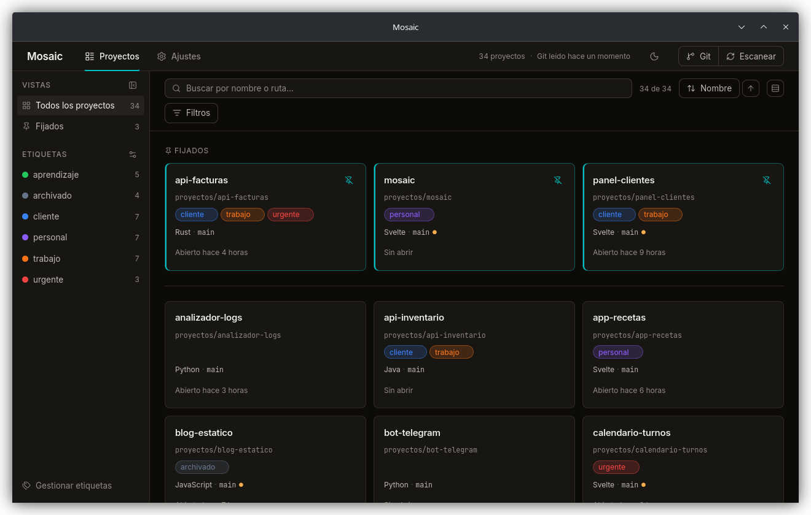
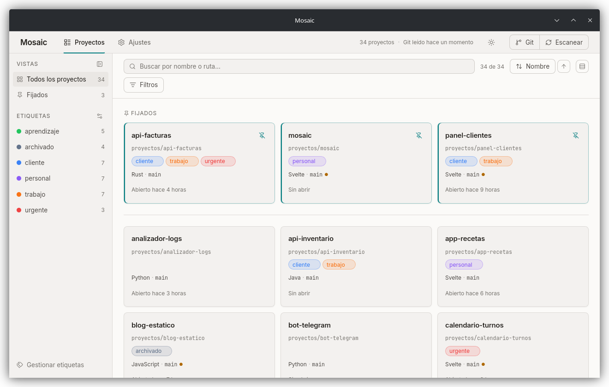

<div align="center">


# Mosaic

**Todos tus proyectos de código, en un solo tablero.**

Mosaic encuentra las carpetas de proyectos que tienes en el disco y las pone en
tarjetas con su estado de Git en vivo, sus etiquetas y un clic para abrirlas en
el editor, la terminal o el explorador.


</div>

<br>



<br>

## Por qué Mosaic

Llega un momento en que tienes cuarenta carpetas en `~/proyectos`, la mitad con
cambios sin commitear que ya no recuerdas, y abrir la que buscas pasa por
`cd`, `ls` y adivinar. Mosaic es la vista de pájaro de todo eso.

Y es deliberadamente sencillo:

| | |
|---|---|
| **Local de verdad** | Todo vive en una base SQLite en tu máquina. Mosaic no hace ni una petición de red: ni siquiera `git fetch`. |
| **Privado** | Sin cuentas, sin telemetría, sin analítica. |
| **Sin IA** | Ninguna API de modelos. Lee metadatos y te los enseña, nada más. |
| **De solo lectura** | Lee tus repositorios; nunca escribe en ellos. |
| **Ligero** | Pensado para cientos de proyectos. Git se lee en segundo plano, sin bloquear la interfaz. |

## Lo que hace

**Encuentra tus proyectos solo.** Le das una o varias carpetas raíz y las
recorre buscando `.git`, `package.json`, `Cargo.toml`, `pyproject.toml`,
`go.mod`, `pom.xml`, `build.gradle`, `composer.json` o `Gemfile`. Deduce el
lenguaje principal de cada uno y se salta `node_modules`, `target`, `.venv` y
compañía.

**Git de un vistazo.** Rama, cambios sin commitear, commits por delante y por
detrás del upstream y último commit. Se refresca solo en segundo plano, y el
botón **Git** de la cabecera fuerza una relectura y te dice qué ha cambiado.

**Un clic para abrir.** Cada tarjeta abre el proyecto en tu editor, tu
terminal o tu explorador de archivos. Mosaic detecta los que tienes
instalados y puedes elegir cuál prefieres.

**Etiquetas con color.** Se asignan desde la propia tarjeta, se crean al vuelo
escribiendo un nombre nuevo y se gestionan (renombrar, recolorear, borrar)
desde su panel.

**Búsqueda y filtros.** Búsqueda difusa por nombre y ruta, sin importar
acentos ni mayúsculas. Filtros por etiqueta, lenguaje, estado de Git,
destacados y proyectos que ya no están en el disco, y cuatro órdenes
distintos.

**Recuerda dónde lo dejaste.** Búsqueda, filtros, orden, densidad y tema se
guardan solos: al volver a abrir Mosaic lo encuentras tal cual.

**Claro, oscuro o el del sistema.** Con un botón en la cabecera.

<br>


<table>
  <tr>
    <td width="58%"></td>
    <td width="42%"></td>
  </tr>
  <tr>
    <td align="center"><sub>Gestor de etiquetas</sub></td>
    <td align="center"><sub>Etiquetar desde la tarjeta</sub></td>
  </tr>
</table>



## Primeros pasos

1. Abre **Ajustes** y añade la carpeta donde guardas tus proyectos. Puedes
   añadir varias y desactivar las que no quieras mirar por un tiempo.
2. Pulsa **Escanear**. Mosaic recorre el disco y llena el tablero.
3. Etiqueta, destaca y filtra. La vista que dejes es la que te encontrarás la
   próxima vez.

El estado de Git se lee solo a los cinco segundos de arrancar y después cada
cinco minutos.

## Cómo decide qué es un proyecto

Una carpeta entra en el tablero si tiene alguno de los ficheros marcadores y,
además, **o tiene su propio `.git`, o ninguna carpeta por encima está ya
registrada**. En la práctica: un monorepo es una tarjeta, y dos repositorios
anidados son dos.

- Baja cuatro niveles por defecto y nunca sigue enlaces simbólicos, así que los
  ciclos no le afectan.
- Si una raíz pasa de 50.000 entradas, se detiene y el resumen avisa de que el
  escaneo quedó incompleto, en vez de fallar en silencio.
- Un proyecto que desaparece del disco **se marca como ausente, no se borra**:
  conserva sus etiquetas por si vuelve.

<details>
<summary><b>Escanear al arrancar</b> (todavía sin interfaz)</summary>

<br>

Por defecto Mosaic no toca el disco al abrirse: pinta lo que ya tenía guardado
y espera a que pulses **Escanear**. Si prefieres que se actualice solo, hay un
ajuste que lanza un escaneo ocho segundos después de arrancar y refresca el
estado de Git al terminar. Su interfaz llega en la Fase 6; hasta entonces se
activa así:

```bash
sqlite3 ~/.local/share/mosaic/mosaic.db \
  "INSERT INTO settings (key, value) VALUES ('scan.on_startup', 'true')
   ON CONFLICT(key) DO UPDATE SET value = 'true';"
```

</details>

## Estado

**Alfa.** Se usa a diario, pero aún le faltan piezas. El detalle está en el
[roadmap](docs/ROADMAP.md).

| | Fase | |
|---|---|---|
| ✅ | 1 · Escaneo de proyectos | Raíces configurables, marcadores, lenguaje principal |
| ✅ | 2 · Integración con Git | Estado en vivo, refresco en segundo plano |
| ✅ | 3 · Tablero | Tarjetas, destacados, apertura en editor y terminal |
| ✅ | 4 · Etiquetas, búsqueda y filtros | Y la vista guardada entre sesiones |
| ✅ | Rediseño visual | Sistema de diseño propio, tema claro y oscuro |
| 🔜 | 5 · Detalle de proyecto | README renderizado, historial, ramas y notas |
| ⬜ | 6 · Pulido | Atajos de teclado y ajustes avanzados con interfaz |
| 🟡 | 7 · Distribución | Instaladores listos; falta publicar y firmar |

## Descargas

Todavía no hay una versión publicada. El workflow de release ya compila los
instaladores de las tres plataformas, y saldrán en la página de
[releases](https://github.com/IzanVil/mosaic/releases) en cuanto haya una:

| Plataforma | Formatos |
|---|---|
| macOS (Intel y Apple Silicon) | `.dmg`, binario universal |
| Windows | `.msi` e instalador `.exe` |
| Linux | `.deb`, `.rpm` y `.AppImage` |

Los binarios **no irán firmados**, porque firmar cuesta dinero en las dos
plataformas que lo exigen. macOS pedirá permiso en *Ajustes → Privacidad y
seguridad* la primera vez, y Windows mostrará el aviso de SmartScreen.

Mientras tanto, compilarlo son dos órdenes.

## Compilar

Necesitas Rust estable, Node 20 o superior, [pnpm](https://pnpm.io) y las
dependencias de sistema de Tauri 2. En Fedora:

```bash
sudo dnf install webkit2gtk4.1-devel libsoup3-devel gtk3-devel \
                 openssl-devel curl wget file
```

Para otras distribuciones, macOS y Windows, mira
[los requisitos de Tauri](https://tauri.app/start/prerequisites/).

```bash
pnpm install          # dependencias del frontend
pnpm tauri dev        # la app en modo desarrollo
pnpm tauri build      # binario de release
```

<details>
<summary><b>Tests y comprobaciones</b></summary>

<br>

Frontend:

```bash
pnpm check            # svelte-check, falla también con avisos
pnpm test             # tests de vitest
pnpm build            # build de producción
```

Backend:

```bash
cd src-tauri
cargo test
cargo clippy --all-targets -- -D warnings
cargo fmt --check
cargo llvm-cov --summary-only   # cobertura
```

La lógica de dominio vive en `src-tauri/src/core/`, que es lo que cubren los
tests unitarios; los de integración están en `src-tauri/tests/`. El nivel de
logs se controla con `MOSAIC_LOG` (por ejemplo, `MOSAIC_LOG=debug pnpm tauri dev`).

</details>

## Hecho con

| | |
|---|---|
| **Backend** | Rust y [Tauri 2](https://tauri.app). SQLite con `rusqlite`. Repositorios leídos con `git2`, compilado sin soporte de red. |
| **Frontend** | [Svelte 5](https://svelte.dev) con TypeScript estricto y Vite. Búsqueda difusa con `fuse.js`. |
| **Diseño** | Sistema propio de tokens en oklch, con neutros cálidos y acento turquesa. Inter y JetBrains Mono van empaquetadas, sin cargarlas de internet. |

## Documentación

- [Arquitectura](docs/ARCHITECTURE.md): capas, escáner, modelo de datos y
  decisiones técnicas.
- [Sistema de diseño](docs/DESIGN.md): color, tipografía y el porqué de cada
  elección.
- [Roadmap](docs/ROADMAP.md): qué está hecho y qué viene.

## Dónde guarda los datos

| Sistema | Ruta |
|---|---|
| Linux | `~/.local/share/mosaic/mosaic.db` |
| macOS | `~/Library/Application Support/dev.izan.mosaic/mosaic.db` |
| Windows | `%APPDATA%\izan\mosaic\data\mosaic.db` |

Es un único fichero SQLite. Para empezar de cero, cierra Mosaic y bórralo.

## Licencia

[MIT](LICENSE).
